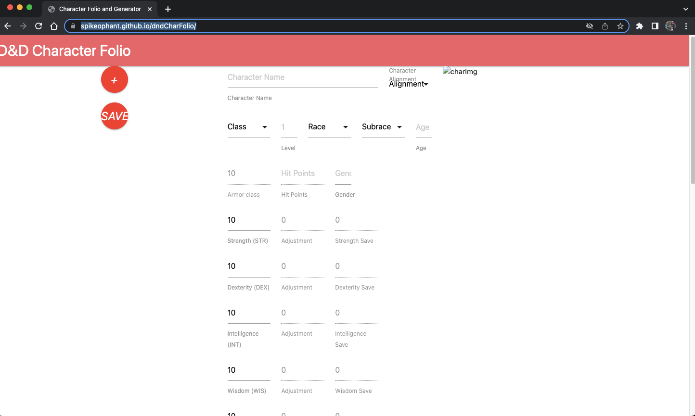

# DnD Character Folio

## Description

A website for generating mostly random D&D characters and storing them.  We love to play table top and having the ability to 
quickly generate characters, as well as keep track of them, and their belongings, and level them up, is a must have.

For now it just allows you to generates, save and load.

## Installation

No installation required.  For local development check out repository and open in your favorite editor.

## Usage

To use this application simply go here: [https://spikeophant.github.io/dndCharFolio/](https://spikeophant.github.io/dndCharFolio/)

To add a screenshot, create an `assets/images` folder in your repository and upload your screenshot to it. Then, using the relative filepath, add it to your README using the following syntax:

## Credits

https://github.com/justinwl1998
https://github.com/Spikeophant
https://github.com/Gnubgnub

## License

